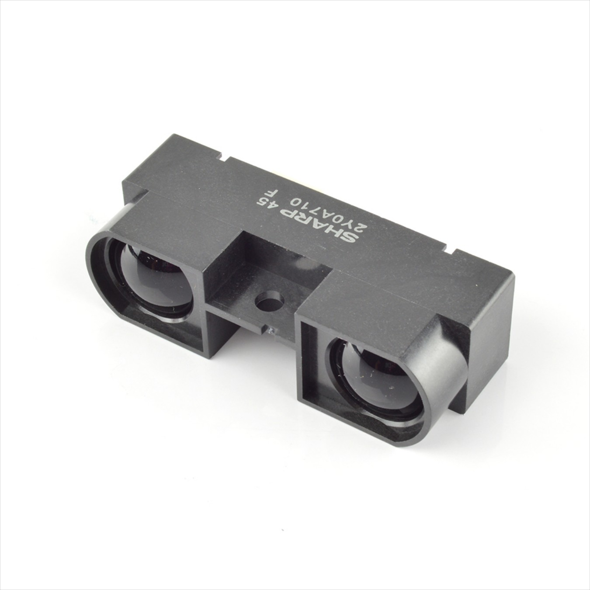
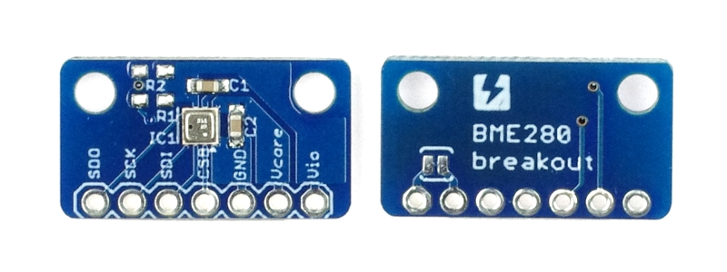

# Environment Sensing and Object Distance Measurement
This porgram shows the values of the temperature, humidity, barometric pressure and altitude by the connected BME280 sensor and also measures the distance of an object by the Sharp-IR sensor.

# Items Used
-	[Arduino Uno Rev3](https://store.arduino.cc/usa/arduino-uno-rev3)
-	[BME280 Temperature, Humidity and Pressure Sensor](https://www.adafruit.com/product/2652)
- [Sharp GP2Y0A710K0F IR Range Sensor](https://www.robotshop.com/en/sharp-gp2y0a710k0f-ir-range-sensor.html)
-	[Breadboard](https://www.adafruit.com/product/64)
-	[Male to Male Jumper Wires](https://www.adafruit.com/product/758)
- [Arduino IDE](https://www.arduino.cc/en/software)

# Skills Required
- Breadboarding
- I2C and SPI Serial Communication protocol
- Basic Arduino Programming

# Implementation Steps

### tep-1: Wire up the BME280 Sensor with the Arduino by using SPI serial interface. 

### Step-2: Wire Up the SharpIR Sensor with the Arduino by connecting to the Analog pin A0 on the Arduino.

### Step-3: Upload program to the Arduino board.

### Step-4: Open Serial Monitor and a menu is displayed first. Choose from the menu what value you want to see.
- If you type '1' on the serial input then BME280 values like temperature, humidity, pressure and altitude are displayed on the serial monitor on the interval of every half second.
- If you type '2', then the current execution is halted and you get back to the menu.
- If you type '3', then the object distance is displayed from the SharpIR sensor.

### SharpIR Sensor

### BME280 Sensor

